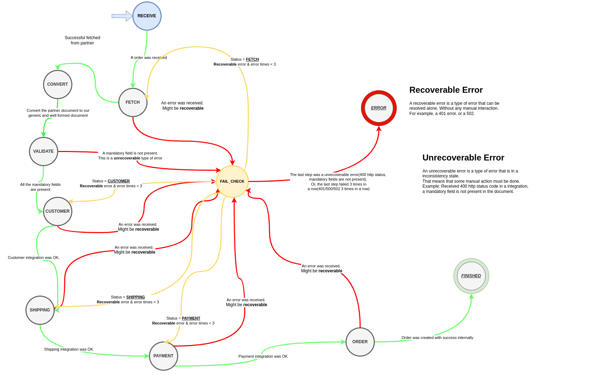
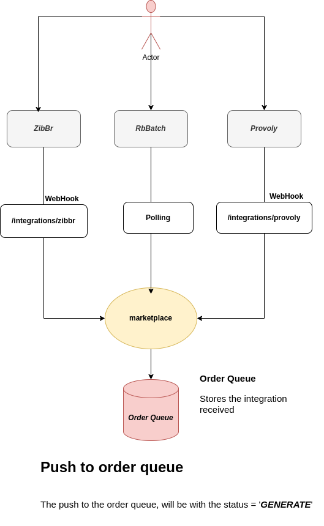
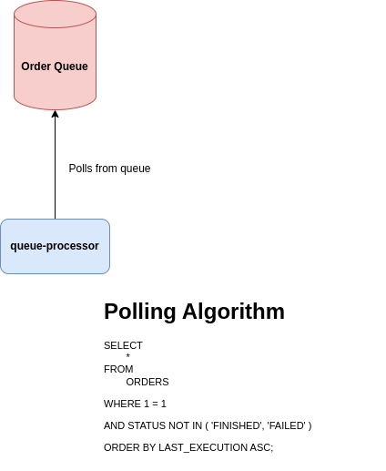

# Summary

- [Introduction](#Introduction)
- [Marketplaces](#Marketplaces)
- [Steps](#Steps)
- [Status](#Status)
  - [Non-Terminals](#Non-Terminals)
  - [Terminals](#Terminals)
- [Processor](#Processor)
  - [Polling Algorithm](#Polling-Algorithm)
- [Questions](#Questions)

# Introduction

This demo is to demonstrate how we can easily integrate marketplace partners with our system.  
In this basic example, we are working with some marketplaces.

The finite state machine it's this:   


The finite state machine, is coded like:  
```java
final var transitions = new EnumMap<>(Status.class);
transitions.put(Status.GENERATE, Status.RECEIVE);
transitions.put(Status.RECEIVE, Status.FETCH);
transitions.put(Status.FETCH, Status.CONVERT);
transitions.put(Status.CONVERT, Status.VALIDATE);
transitions.put(Status.VALIDATE, Status.SHIPPING_INTEGRATION);
transitions.put(Status.SHIPPING_INTEGRATION, Status.ORDER_INTEGRATION);
transitions.put(Status.ORDER_INTEGRATION, Status.FINISHED);
```

# Marketplaces

For this demo, we have two marketplaces.   

- ZIBBR
    
    A brazilian company, they exchange data with us with **Http**, calling the **WebHook** with the order object completely.  

- PROVOLY

    A brazilian company, they exchange data with us with **Http**, calling the **Webhook** with a list of orders to be fetched from their api.

- RbBatch
    
    Another brazilian company, they exchange data with us, storing on a ftp server on their server.   
    So, we need to retrieve the files from there ...

How integrations are receive:   


# Steps

Every step is responsible for doing just one thing and do this thing well.   
For example, the Fetch Processor is responsible for only retrieve the order from the marketplace with the data that was received in the step before.

The step then produce a instance of **BaseStep**.

For example, this is the signature of the interface **BaseStep**, by convention, any new step "ought" implement this interface ...   
```java
public interface BaseStep
{
    Status getStatus();
}
```

Since, we can not totally define the "data", like a http body, we do not define any type of `getData`. 


# Status

Every status means what is the current state of a "pre-order".   

- ## Non-Terminals

    The non-terminals statuses, once here, the "pre-order" is not finished yet.

  - **Generate**

      The initial step.   

  - **Receive**

      Uses the data from generate step.       
      May create new integrations.   

  - **Fetch**

      Uses the data from Receive.   
      Some implementations of FetchProcessor execute a Http call to the partner endpoint.   
      Others, just forward the data received in the Receive Step.

  - **Convert**

      Uses the data from Fetch.   
      Every partner must override the main interface(`ConvertFetch`) and implement the convert function that maps from partner order to our internal "pre-order".

  - **Validate**

      Uses de data from Convert.   
      Validate the "pre-order" document, and then outputs invalid/missing fields.

  - **Shipping Integration**

      Uses the data from Convert.    
      The shipping is an internal REST API, that simulates 

  - **Order Integration**

      Uses the data from Shipping and Convert steps.    
      The order is an internal Rest API too.    

- ## Terminals

    There are some statuses, called **Terminals**.  
    Once a "pre-order" reaches any of these statuses, it is considered to be "FINISHED".

    - **FAILED**

        Used to indicate that the "pre-order" failed in some step.   
        And there is no way to recover it without manual intervention ...

    - **FINISHED**
    
        Used to indicate that the "pre-order" is now a "order" internally.   
        Indicate that every step ran successfully.

# Processor

The processor can be run in a dedicated thread, or even N threads.
> If running in one thread, and just one instance, we do not need to "mark" the register as in processing ...   
To prevent other threads/instance to fetch the same integration object while its processing by another one ...

- ## Polling Algorithm

    The polling algorithm is easy.   
    We just fetch integrations witch their actual status is not **FINISHED** and **FAILED** and then sort them by last execution date.

    

# Questions

Common questions answered.

1. How do I add a new marketplace partner?  

    First, need to know, how will this marketplace communicate with us. 
    There are some options already here.  

    First, we need to know how will be integration(REST API, FTP)

    - HTTP:
        
      - They do a http request to an endpoint that we defined.

          For example, `POST /orders/v1/integrations/{PARTNER_NAME}`    
          After this, we need to know, how they will send they send the order for us.    
          They might send the complete json(like `ZIBBR` partner), or a list of the orders(like `PROVOLY`) ... 

    - Implement the Fetch processors

        The **FetchProcessor**, retrieves the order when needed and just forward the order document when we already have.

    - Implement the Convert processors
   
        The **ConvertProcessor**, converts the marketplace order to an internal PreOrder.

2. I need a step before two well know steps

    In this case, you might need to create new statuses and maybe a new finite state machine